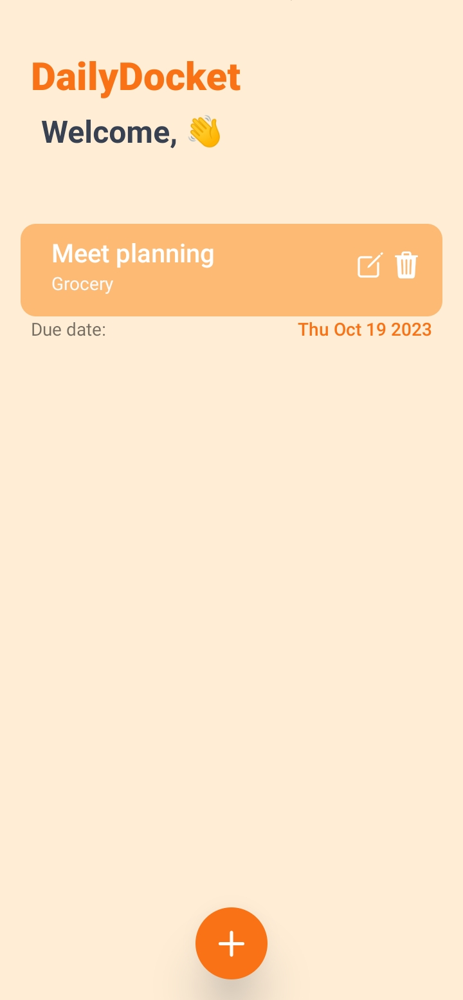

# DailyDocket - Your Simple Todo List App 📝

Welcome to DailyDocket, a user-friendly and intuitive mobile Todo List app designed to help you manage your daily tasks effortlessly.

## Features

- **Add and Manage Tasks:** Easily add, edit, and remove tasks.
- **Set Due Dates:** Keep track of your task deadlines with due dates.
- **Mark Tasks as Complete:** Stay organized by marking completed tasks.

## Installation

1. Download the DailyDocket app from the [Google Play Store](#) or [Apple App Store](#).
2. Install the app on your mobile device.
3. Open the app and start managing your tasks.

## Contributing

We welcome contributions from the community. If you'd like to contribute to DailyDocket, please follow these steps:

1. Fork the repository.
2. Create a new branch for your feature: `git checkout -b feature-name`
3. Commit your changes: `git commit -m 'Add a new feature'`
4. Push your changes to your fork: `git push origin feature-name`
5. Open a pull request.

## License

This project is licensed under the MIT License. See the [LICENSE](LICENSE) file for details.

## Contact

Have questions or suggestions? Feel free to reach out:

- Email: mhassankhanw3@gmail.com
- LinkedIn: [Hassan Khan](https://www.linkedin.com/in/hassan-khan-0b0508233/)
- GitHub: [mhassankhanw3](https://github.com/mhassankhanw3)

Thank you for using DailyDocket! We hope it helps you stay organized and productive.

